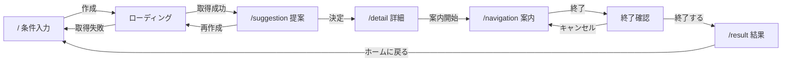

# ミチシル 仕様書

- 文書種別: 現行仕様（As-Is）
- 対象バージョン: 1.0.0
- 最終確認日: 2026年8月26日
- 対象コード: `src/`、`amplify/`、`tools/`、`index.html`、各設定ファイル
- 関連文書: [設計書](./設計書.md) / [規約差分レポート](./規約差分レポート.md)

---

## 1. 本書の目的

本書は、現在実装されている「ミチシル」の外部仕様をコードに基づいて記録する。ステアリングガイドの技術前提（Vue 3 + Vue Router + Pinia / AWS Lambda / DynamoDB）へ移行した後の状態を対象とする。

---

## 2. アプリ概要

| 項目 | 内容 |
|---|---|
| アプリ名 | ミチシル |
| 種類 | ルート提案型お散歩アプリ |
| 主目的 | 目的・カテゴリ・距離を選ぶと、条件に合う散歩ルートを提案する |
| 想定端末 | スマートフォン（画面幅最大430pxのレイアウト） |
| フロントエンド | Vue 3（Composition API）+ Vue Router + Pinia |
| バックエンド | AWS Lambda（Handler / Service / Repository / Validator の4層） |
| データストア | DynamoDB（テーブル未作成。未設定時はローカルデータで動作） |
| ビルド | Vite |
| 静的検査 | ESLint |

---

## 3. 対象範囲

### 3.1 実装済み

- 目的・カテゴリ・距離の選択
- 入力条件の検証（フロントエンドとサーバー側の両方）
- 条件に応じたルートの取得と表示
- ルート提案・詳細・案内・結果の各画面
- 同じ条件でのルート再作成
- 案内終了の確認
- URL単位の画面管理とリロード対応
- APIのエラー応答と画面へのエラー表示
- ルート取得APIの単体テスト

### 3.2 未実装

- AIによるルート生成
- 実地図の表示、経路探索
- GPSによる現在地取得、経路案内の進行管理
- 実測値による散歩結果の集計
- ユーザー認証、履歴、お気に入り
- DynamoDBテーブルの作成とデプロイ
- フロントエンドの自動テスト

---

## 4. 画面仕様

### 4.1 URLと画面の対応

| URL | ルート名 | 画面 | 直接アクセス |
|---|---|---|---|
| `/` | `route-condition` | 条件入力 | 可能 |
| `/suggestion` | `route-suggestion` | ルート提案 | ルート未取得なら`/`へ戻る |
| `/detail` | `route-detail` | ルート詳細 | 同上 |
| `/navigation` | `route-navigation` | ルート案内 | 同上 |
| `/result` | `walk-result` | 散歩結果 | 同上 |
| 上記以外 | なし | なし | `/`へリダイレクト |

ローディング表示と案内終了の確認は、URLを持たない表示状態として実装している。

### 4.2 各画面の仕様

| 画面 | 主な表示 | 操作と結果 |
|---|---|---|
| 条件入力 | 目的4択、カテゴリ4択、距離スライダー | 「ルートを作成」でAPIを呼び、成功で提案画面へ |
| ローディング | ロゴ、作成中メッセージ | 操作なし。取得完了で自動的に切り替わる |
| ルート提案 | ルート名、説明、所要時間、距離、経由地 | 「決定」で詳細へ。「再作成」で同条件で再取得 |
| ルート詳細 | 経路の概略、総距離 | 「案内開始」で案内へ |
| ルート案内 | 現在地、経路、経由地、進行方向 | 「終了」で確認を表示 |
| 終了確認 | 確認メッセージ | 「キャンセル」で案内へ戻る。「終了する」で結果へ |
| 散歩結果 | 総距離、経由地数、所要時間 | 「ホームに戻る」で条件をリセットして条件入力へ |

表示内容はすべてAPIの応答から生成する。画面に固定値を埋め込んでいる箇所はない。

### 4.3 地図表示について

地図は実地図ではなく、CSSで描画した簡易表示である。経由地の配置位置は、取得したルートの経由地の並び順に応じて割り当てる。

---

## 5. 入力仕様

### 5.1 目的

単一選択。初期値は未選択。

| 表示 | 内部値 |
|---|---|
| 気分転換 | `refresh` |
| 運動 | `exercise` |
| 観光 | `sightseeing` |
| カフェ巡り | `cafe` |

### 5.2 カテゴリ

単一選択。初期値は未選択。

| 表示 | 内部値 |
|---|---|
| 自然 | `nature` |
| 街歩き | `city` |
| 歴史 | `history` |
| グルメ | `gourmet` |

### 5.3 距離

スライダーで選択する。つまみ位置は`0`〜`3`の4段階で、中間の値は選べない。

| つまみ位置 | 距離 |
|---:|---|
| 0 | 1 km |
| 1 | 3 km（初期値） |
| 2 | 5 km |
| 3 | 8 km |

選択中の距離はスライダー上部に表示し、目盛りとして`1 / 3 / 5 / 8`を表示する。

### 5.4 入力チェック

| 段階 | 動作 |
|---|---|
| 画面 | 目的またはカテゴリが未選択のとき「ルートを作成」を押せない状態にし、案内文を表示する |
| サーバー | 必須項目の有無、許可値との一致を検証し、不正なら400を返す |

画面側だけでなくサーバー側でも検証するため、APIを直接呼び出した場合も不正な値は受け付けない。

---

## 6. 画面遷移



URLが変わるため、ブラウザの戻る・進む操作が利用できる。リロードするとルート情報が失われるため、条件入力画面へ戻る。

---

## 7. API仕様

### 7.1 ルート取得

```text
GET /api/v1/routes
```

**リクエストパラメータ**

| 名前 | 必須 | 型 | 許可値 |
|---|---|---|---|
| `purpose` | 必須 | 文字列 | `refresh` / `exercise` / `sightseeing` / `cafe` |
| `category` | 必須 | 文字列 | `nature` / `city` / `history` / `gourmet` |
| `distance` | 必須 | 数値 | `1` / `3` / `5` / `8` |

**正常応答:** HTTP 200 / `application/json; charset=utf-8`

```json
{
  "routeId": "4f3c1b6e-6f1a-4a2e-9b5c-6d7f8a9b0c11",
  "routeName": "緑とカフェのんびりコース",
  "description": "公園とカフェを巡る、歩きやすいルート",
  "distance": 3,
  "duration": 45,
  "waypoints": [
    { "waypointId": "w-0001", "name": "緑の公園", "type": "park", "icon": "🌳" },
    { "waypointId": "w-0002", "name": "展望スポット", "type": "viewpoint", "icon": "📷" },
    { "waypointId": "w-0003", "name": "こもれびカフェ", "type": "cafe", "icon": "☕" },
    { "waypointId": "w-0004", "name": "やすらぎ神社", "type": "shrine", "icon": "⛩️" }
  ],
  "createdAt": "2026-08-01T00:00:00.000Z"
}
```

`duration`は距離から算出する（1kmあたり15分）。

**エラー応答**

| HTTP | `code` | 発生条件 |
|---:|---|---|
| 400 | `VALIDATION_ERROR` | 必須項目の不足、許可値以外の指定 |
| 404 | `ROUTE_NOT_FOUND` | 条件に合うルートが存在しない |
| 503 | `DATA_SOURCE_ERROR` | データストアへのアクセスに失敗 |
| 500 | `INTERNAL_ERROR` | 想定外の失敗 |

```json
{
  "code": "VALIDATION_ERROR",
  "message": "distanceが不正です（許可値: 1, 3, 5, 8）"
}
```

### 7.2 ルート選択の規則

1. カテゴリと距離が一致するルートを検索する。
2. 見つからない場合、同じカテゴリのルートを検索する。
3. 候補のうち目的が一致するものを優先する。
4. 残った候補から、希望距離との差が最も小さいものを選ぶ。
5. 候補が無い場合は404を返す。

---

## 8. データ仕様

### 8.1 テーブル

| 項目 | 内容 |
|---|---|
| テーブル名 | 環境変数`ROUTE_TABLE_NAME`で指定（例: `dev-Route`） |
| パーティションキー | `routeId`（UUID v4） |
| GSI | `GSI-CategoryDistance`（`category` + `distance`） |

### 8.2 属性

| 属性 | 型 | 内容 |
|---|---|---|
| `routeId` | 文字列 | ルートのID |
| `routeName` | 文字列 | ルート名 |
| `description` | 文字列 | 説明 |
| `category` | 文字列 | カテゴリ |
| `purpose` | 文字列 | 目的 |
| `distance` | 数値 | 距離（km） |
| `waypoints` | 配列 | 経由地の一覧 |
| `createdAt` | 文字列 | 作成日時（ISO 8601） |

### 8.3 テーブル未設定時の動作

`ROUTE_TABLE_NAME`が未設定の場合、`amplify/functions/getRoute/seedRoutes.js`のローカルデータを参照する。AWS環境が無い状態でも画面を通しで確認できるようにするための仕組みで、本番では使用しない。

登録済みのローカルデータは5件で、カテゴリと距離の組み合わせは次のとおり。

| ルート名 | カテゴリ | 距離 |
|---|---|---:|
| 緑とカフェのんびりコース | `nature` | 3 km |
| まちなか歴史めぐり | `history` | 5 km |
| ぐるっと商店街コース | `city` | 1 km |
| たっぷり歩く river コース | `nature` | 8 km |
| food めぐり散歩コース | `gourmet` | 3 km |

---

## 9. 状態とデータ保持

入力条件と取得したルートはPiniaのストアに保持する。LocalStorage、Cookie、サーバー側のセッションは使用しないため、リロードすると初期状態へ戻る。

「ホームに戻る」では、目的・カテゴリ・取得済みルートに加えて距離も初期値（3 km）へ戻す。

---

## 10. 環境変数

| 名前 | 用途 | 未設定時 |
|---|---|---|
| `ROUTE_TABLE_NAME` | ルートを格納するDynamoDBのテーブル名 | ローカルデータを参照する |
| `LOCAL_API_PORT` | ローカル開発用APIの待ち受けポート | `3001` |

---

## 11. 起動・停止仕様

### 11.1 セットアップ

```powershell
npm ci
```

### 11.2 開発時の起動

```powershell
npm run dev
```

フロントエンドの開発サーバーとローカルAPIを同時に起動する。

| 用途 | アクセス先 |
|---|---|
| 画面 | `http://localhost:3000/` |
| API | `http://127.0.0.1:3001/api/v1/routes` |
| 同一LANのスマートフォン | `http://<PCのLAN IP>:3000/` |

停止は起動したターミナルで`Ctrl+C`。ポート3000が使用中の場合は自動で別ポートへ切り替えず、エラーで停止する。

### 11.3 その他のコマンド

| コマンド | 内容 |
|---|---|
| `npm run dev:web` | 画面の開発サーバーのみ起動 |
| `npm run dev:api` | ローカルAPIのみ起動 |
| `npm run build` | 本番用にビルドして`dist/`へ出力 |
| `npm run preview` | ビルド結果を確認 |
| `npm run lint` | ESLintを実行 |
| `npm run lint:fix` | ESLintの自動修正を実行 |
| `npm test` | Lambda関数の単体テストを実行 |

---

## 12. 非機能仕様（現状）

- レイアウトは最大幅430pxで中央配置する。
- 認証、認可、HTTPS終端、セキュリティヘッダーは未実装。
- APIのレート制限、CORSの明示設定は未実装。
- ログはJSON形式で標準出力へ書き出す（CloudWatch Logsを想定）。
- 対応ブラウザ、性能目標、可用性目標は未定義。
- フロントエンドの自動テストは未整備。
- 終了確認は`role="dialog"`と`aria-modal`を指定しているが、フォーカス移動の制御は未実装。

---

## 13. 未確認事項

| 項目 | 状況 |
|---|---|
| DynamoDBテーブルの作成 | 未実施。AWS環境が必要 |
| Lambdaへのデプロイ | 未実施 |
| 実機ブラウザでの操作確認 | 未実施（ヘッドレスでの描画確認のみ） |
| `purpose`の用語辞書への登録 | 未実施（辞書は別チーム管理） |
| パッケージ名`michishiru-mock`の扱い | 未確定（ローマ字のため要判断） |
