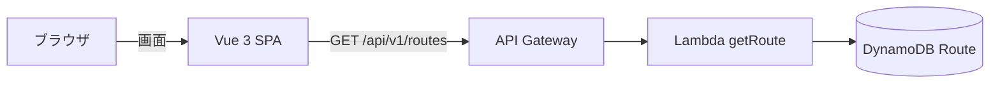
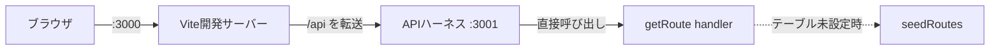
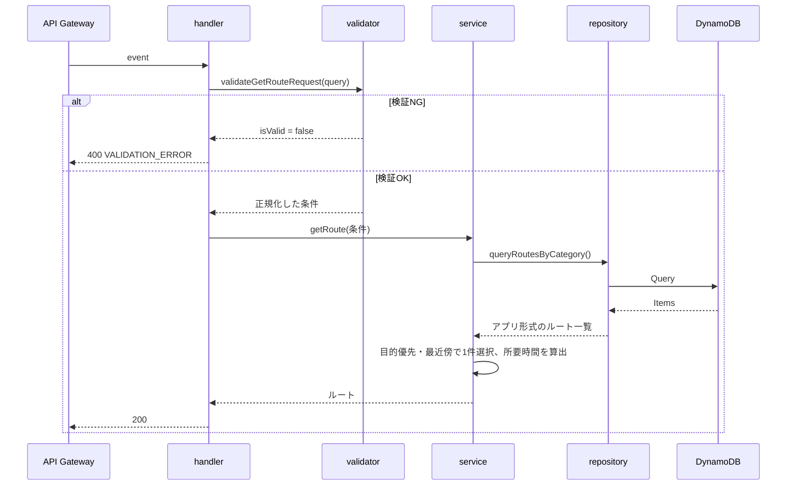

# ミチシル 設計書

- 文書種別: 現行設計（As-Is）
- 対象バージョン: 1.0.0
- 最終確認日: 2026年8月26日
- 関連文書: [仕様書](./仕様書.md) / [規約差分レポート](./規約差分レポート.md)

---

## 1. 設計概要

ミチシルは、Vue 3のSPAとAWS Lambdaのバックエンドで構成する。フロントエンドはURL単位で画面を管理し、データ取得はAPI経由に限定する。バックエンドはHandler / Service / Repository / Validatorの4層に分け、上から下への一方向でのみ呼び出す。



ローカル開発では、API Gatewayの代わりにViteのプロキシとAPIハーネスがLambdaハンドラを呼び出す。



---

## 2. 技術構成

| 分類 | 技術 | バージョン |
|---|---|---|
| 言語 | JavaScript | ES Modules |
| フロントエンド | Vue 3 | 3.5.41 |
| ルーティング | Vue Router | 5.2.0 |
| 状態管理 | Pinia | 4.0.3 |
| ビルド | Vite | 8.2.2 |
| 静的検査 | ESLint | 10.9.1 |
| Vue用ルール | eslint-plugin-vue | 10.10.0 |
| データアクセス | AWS SDK for JavaScript v3 | 3.1118.0 |
| 実行環境 | Node.js | v24系で確認 |
| テスト | Node.js標準テストランナー | 同梱 |

TypeScriptは使用しない。型情報はJSDocで記述する。

---

## 3. ディレクトリ構成

```text
ミチシル/
├── index.html                  # Viteのエントリ
├── vite.config.js              # ビルドと開発サーバーの設定
├── eslint.config.js            # ESLintの設定
├── package.json
├── src/                        # フロントエンド
│   ├── main.js
│   ├── App.vue
│   ├── router/index.js
│   ├── stores/routeStore.js
│   ├── services/routeService.js
│   ├── composables/useRouteCreation.js
│   ├── constants/routeConditions.js
│   ├── utils/
│   ├── assets/
│   │   ├── styles/global.css
│   │   └── images/logo.png
│   ├── views/
│   │   ├── RouteConditionView.vue
│   │   ├── RouteSuggestionView.vue
│   │   ├── RouteDetailView.vue
│   │   ├── RouteNavigationView.vue
│   │   └── WalkResultView.vue
│   └── components/
│       ├── base/               # BaseButton / BaseModal / BaseSlider
│       ├── layout/             # DefaultLayout
│       └── feature/
│           ├── route/          # ルート関連の6コンポーネント
│           └── walk/           # WalkResultStats
├── amplify/                    # バックエンド
│   ├── functions/getRoute/
│   │   ├── handler.js
│   │   ├── service.js
│   │   ├── repository.js
│   │   ├── validator.js
│   │   ├── constants.js
│   │   ├── seedRoutes.js
│   │   ├── package.json
│   │   └── __tests__/
│   └── shared/
│       ├── utils/              # responseBuilder / errorHandler / logger
│       └── constants/          # errorCodes
├── tools/                      # 開発用スクリプト（デプロイ対象外）
│   ├── dev.js
│   └── localApiServer.js
└── docs/
```

---

## 4. フロントエンド設計

### 4.1 責務の分離

| 層 | 配置 | 責務 | 禁止事項 |
|---|---|---|---|
| View | `views/` | 画面の構成、遷移の指示 | 直接のAPI呼び出し |
| Component | `components/` | 表示とユーザー操作の受け取り | データ取得、状態の書き換え |
| Composable | `composables/` | 非同期処理と進行状態の管理 | DOM操作 |
| Service | `services/` | API通信 | 画面状態の保持 |
| Store | `stores/` | 画面間で共有する状態 | HTTP通信 |

データは上から下（props）、イベントは下から上（emit）へ流す。

### 4.2 画面遷移

`router/index.js`がURLと画面を対応付ける。ローディングと終了確認はURLを持たないため、Viewではなくコンポーネントの表示状態として扱う。

ルート未取得の状態で`/suggestion`などを直接開いた場合は、`beforeEach`で条件入力画面へ戻す。ストアを永続化していないため、リロード後は必ず条件入力から始まる。

```javascript
router.beforeEach((to) => {
  if (!to.meta.requiresRoute) {
    return true;
  }

  const routeStore = useRouteStore();

  return routeStore.hasRoute ? true : { name: 'route-condition' };
});
```

### 4.3 状態管理

`stores/routeStore.js`はsetup形式のPiniaストアである。

| 種別 | 名前 | 内容 |
|---|---|---|
| 状態 | `purpose` | 選択した目的 |
| 状態 | `category` | 選択したカテゴリ |
| 状態 | `distance` | 選択した距離（km） |
| 状態 | `currentRoute` | 取得したルート |
| 算出 | `hasRequiredConditions` | 目的とカテゴリが選択済みか |
| 算出 | `hasRoute` | ルートを取得済みか |
| 操作 | `selectPurpose` / `selectCategory` / `selectDistance` | 条件の更新 |
| 操作 | `setCurrentRoute` | 取得結果の保存 |
| 操作 | `resetConditions` | 全条件を初期値へ戻す |

### 4.4 ルート作成の処理フロー


応答が速い場合にローディングが一瞬だけ表示されるのを避けるため、最短800ミリ秒は表示を維持する。

### 4.5 距離スライダーの設計

スライダーが保持する値は距離そのものではなく、選択肢の並び順である。`BaseSlider`は選択肢の配列を受け取り、選択された値を`update:modelValue`で親へ返す。

| 処理 | 内容 |
|---|---|
| 表示 | 選択中の値と単位、目盛りを表示する |
| 入力 | `input`イベントでつまみ位置を取得し、配列から値を引く |
| 読み上げ | `aria-valuetext`に「3 km」形式の文字列を設定する |

`change`ではなく`input`を使うため、つまみを動かしている最中も表示が追従する。

### 4.6 スタイル設計

- 設計トークン（色、影）と全画面共通のスタイルは`assets/styles/global.css`にまとめる。
- クラス名はkebab-caseで統一する。
- 画面の表示切り替えはVue Routerが行うため、CSSでの表示制御は行わない。

---

## 5. バックエンド設計

### 5.1 レイヤーと責務

```text
handler.js    リクエスト受付・レスポンス返却
    ↓
service.js    ビジネスロジック
    ↓
repository.js データアクセス
```

`validator.js`は補助層として、handlerから呼び出す。

| 層 | 呼び出せる相手 | 主な内容 |
|---|---|---|
| handler | validator、service、shared | イベントの解釈、HTTPステータスの決定 |
| service | repository、shared | ルートの選択、所要時間の算出 |
| repository | AWS SDK | クエリ実行、DB形式からアプリ形式への変換 |
| validator | なし（純粋関数） | 必須確認、許可値確認 |

検証では、handlerがrepositoryを直接呼ばないこと、serviceがAWS SDKやHTTPに依存しないことを確認している。

### 5.2 リクエスト処理の流れ



### 5.3 Validator層

`validateGetRouteRequest()`は例外を投げず、検証結果を返す純粋関数として実装している。他の層を呼び出さないため、単体テストが容易である。

```javascript
{
  isValid: boolean,
  errorMessages: string[],
  value: { purpose, category, distance } | null
}
```

`distance`は文字列で届くため、検証時に数値へ正規化する。

### 5.4 Service層

ビジネスロジックは次の3点である。

1. 候補の絞り込み（距離一致 → 同カテゴリ）
2. 目的が一致するルートの優先
3. 希望距離に最も近いルートの選択

所要時間は`distance × WALKING_MINUTES_PER_KM`で算出する。HTTPに依存せず、`event`も参照しない。

テストのためにリポジトリを差し替えられる形にしている。

```javascript
export const getRoute = async (conditions, repository = routeRepository) => { ... };
```

### 5.5 Repository層

| 関数 | 用途 |
|---|---|
| `getRouteById(routeId)` | 主キーによる1件取得 |
| `queryRoutesByCategory({ category, distance })` | GSIによる条件検索 |
| `queryRoutesByCategoryOnly({ category })` | カテゴリのみでの検索 |
| `hasRouteTable()` | テーブルが設定済みかの判定 |

設計上のポイントは次のとおり。

- `DynamoDBDocumentClient`はモジュール内で1度だけ生成し、呼び出しごとに作らない。
- テーブル名は環境変数から取得し、ハードコードしない。
- `Scan`は使用せず、主キーまたはGSIで検索する。
- 取得件数は`Limit`で制限する（既定20件）。
- DynamoDBの項目は`toRoute()`でアプリ形式へ変換し、DB固有の形式を上位へ渡さない。
- スロットリング系の例外は指数バックオフで最大3回リトライする。
- 失敗時はAWS SDKの例外をそのまま投げず、`DATA_SOURCE_ERROR`へ変換する。

### 5.6 エラー処理

| 層 | 扱い |
|---|---|
| repository | 外部サービスの例外を`ApplicationError`へ変換して投げる |
| service | 業務上の意味を持つエラー（該当なし等）を投げる |
| handler | エラーを受け取り、HTTPステータスとメッセージへ変換する |

エラーコードとHTTPステータスの対応は`amplify/shared/constants/errorCodes.js`で一元管理する。

| コード | ステータス |
|---|---:|
| `VALIDATION_ERROR` | 400 |
| `ROUTE_NOT_FOUND` | 404 |
| `DATA_SOURCE_ERROR` | 503 |
| `INTERNAL_ERROR` | 500 |

`ApplicationError`以外の例外は`INTERNAL_ERROR`として扱い、内部情報を応答に含めない。

### 5.7 共通モジュール

| ファイル | 役割 |
|---|---|
| `shared/utils/responseBuilder.js` | 応答の形式を整える |
| `shared/utils/errorHandler.js` | エラーの生成と応答情報への変換 |
| `shared/utils/logger.js` | JSON1行形式でのログ出力 |
| `shared/constants/errorCodes.js` | エラーコードとステータスの対応 |

いずれも特定の関数に依存しない形で実装している。

---

## 6. ローカル開発環境の設計

### 6.1 構成

| プロセス | ポート | 役割 |
|---|---:|---|
| Vite開発サーバー | 3000 | 画面の配信、`/api`のプロキシ |
| APIハーネス | 3001 | Lambdaハンドラの呼び出し |

`tools/dev.js`が両方を子プロセスとして起動し、いずれかが終了した場合は両方を停止する。

### 6.2 APIハーネス

`tools/localApiServer.js`はAPI Gateway相当のイベントを組み立て、Lambdaハンドラをそのまま呼び出す。ビジネスロジックを持たないため、本番とローカルで処理が二重にならない。

```javascript
const buildEvent = (request, requestUrl) => ({
  httpMethod: request.method,
  path: requestUrl.pathname,
  queryStringParameters: Object.fromEntries(requestUrl.searchParams.entries()),
  headers: request.headers
});
```

待ち受けは`127.0.0.1`に限定し、外部からのアクセスはViteのプロキシ経由に絞っている。

### 6.3 ポートの扱い

Viteは`strictPort: true`を指定している。ポート3000が使用中の場合に別ポートへ自動切り替えすると、APIハーネスのポートと衝突して原因が分かりにくい不具合になるため、明示的に失敗させる。

---

## 7. テスト設計

| 対象 | ファイル | 件数 |
|---|---|---:|
| Validator | `__tests__/validator.test.js` | 6 |
| Service | `__tests__/service.test.js` | 4 |

Node.js標準のテストランナーを使用し、外部のテストフレームワークは導入していない。Serviceのテストではリポジトリを差し替え、DynamoDBへ接続せずに検証する。

実行コマンドは次のとおり。

```powershell
npm test
```

`node --test`にディレクトリを渡すと解決に失敗するため、テストファイルのパターンを指定している。

---

## 8. 静的検査の設計

`eslint.config.js`はフラット設定で、対象ごとにグローバル変数を切り替える。

| 対象 | グローバル |
|---|---|
| `src/**` | ブラウザ |
| `amplify/**`、`tools/**`、`*.config.js` | Node.js |

規約に対応する主なルールは次のとおり。

| ルール | 対応する規約 |
|---|---|
| `vue/multi-word-component-names` | コンポーネント名は2語以上 |
| `vue/attribute-hyphenation` | テンプレートの属性はkebab-case |
| `vue/require-default-prop` | propsに既定値または必須指定 |
| `vue/require-prop-types` | propsに型指定 |
| `vue/require-explicit-emits` | emitは宣言してから使用 |

---

## 9. 設計上の判断と根拠

| 判断 | 内容 | 根拠 |
|---|---|---|
| 「ジャンル」を`category`に変更 | 用語辞書の既存用語を使用 | 同じ概念に複数の英語を使わない方針のため |
| ローディングをViewにしない | コンポーネントの表示状態として実装 | URLを持たないため「1ルート = 1 View」に合わない |
| 終了確認を`BaseModal`に | 汎用のモーダル部品として実装 | 他画面でも再利用できる形にするため |
| 3秒固定の待機を廃止 | 実際のAPI応答時間に置き換え | 待機時間の偽装は本番の挙動と乖離するため |
| リポジトリを引数で差し替え | Serviceのテスト用 | AWS接続なしで業務ロジックを検証するため |
| ローカルデータのフォールバック | テーブル未設定時に使用 | AWS環境が無い状態でも画面確認を可能にするため |
| APIハーネスを`tools/`に配置 | デプロイ対象外として分離 | 本番はAPI Gatewayが担うため |

---

## 10. 未対応の設計課題

| 優先 | 課題 | 対応方針 |
|---|---|---|
| 高 | DynamoDBテーブルが未作成 | `dev-Route`等を作成し、GSIとシードデータを投入する |
| 高 | Lambdaのデプロイ定義が未整備 | Amplifyの設定を追加し、環境変数とIAMロールを定義する |
| 中 | 認証・認可が未実装 | ユーザー単位のデータを扱う段階で導入する |
| 中 | フロントエンドのテストが無い | コンポーネントテストの導入を検討する |
| 中 | CORSとレート制限が未設定 | API Gatewayの設定として定義する |
| 中 | モーダルのフォーカス制御が未実装 | フォーカストラップと復帰処理を追加する |
| 低 | ページネーションが未使用 | 一覧取得を追加する際に`nextToken`方式で実装する |
| 低 | パッケージ名がローマ字 | 固有名詞として扱うか英語名へ変更するかを決める |

---

## 11. 文書の扱い

本書は2026年8月26日時点のコードを正とした現行資料である。`docs/仕様書スライド.html`は移行前に作成した説明資料であり、現在の構成とは一致しない。
