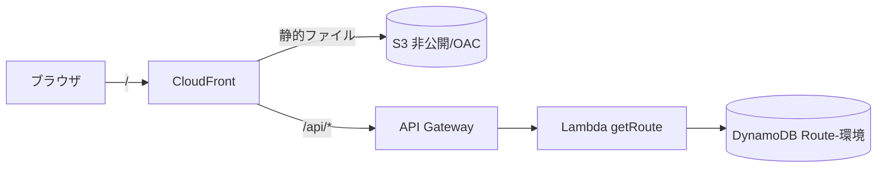
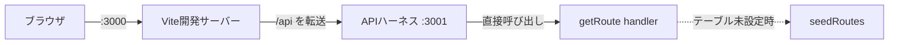
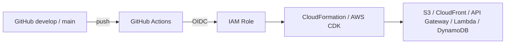
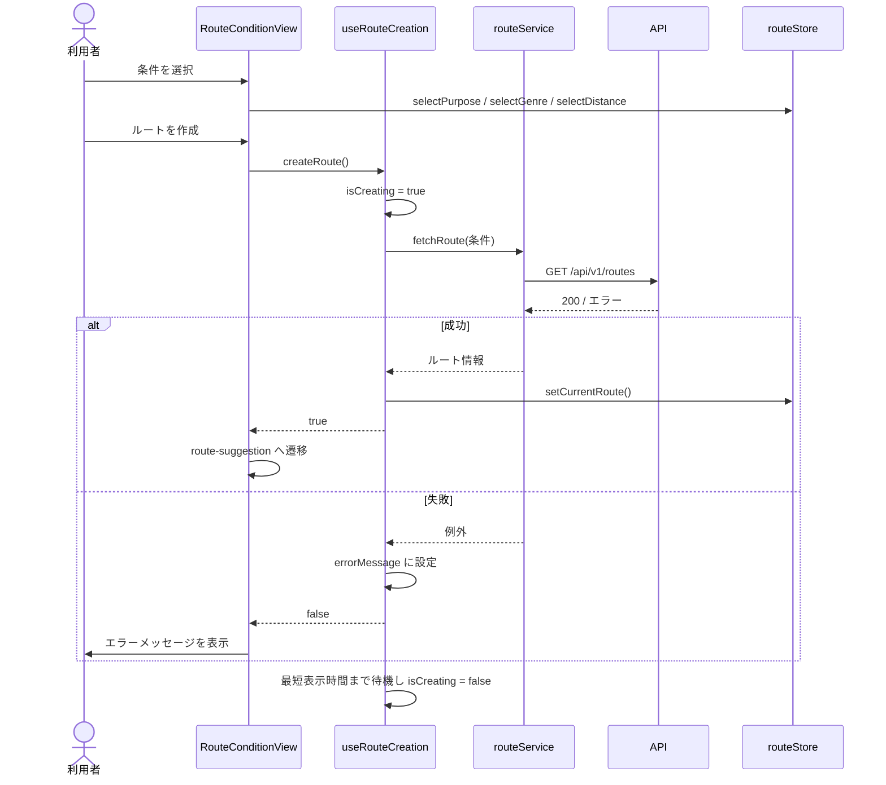
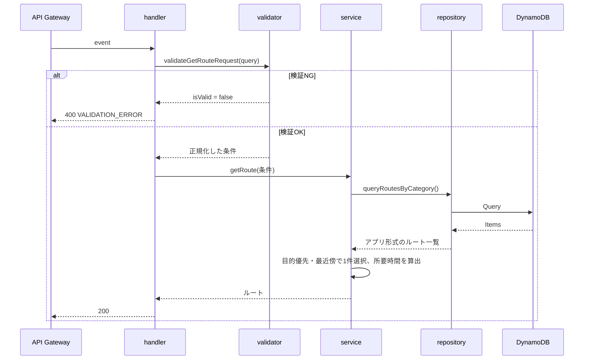

# ミチシル 設計書

- 文書種別: 現行設計（As-Is）
- 対象バージョン: 1.0.0
- 最終確認日: 2026年9月2日
- 関連文書: [仕様書](./仕様書.md) / [検索条件マスタAPI連携 実装説明書](./検索条件マスタAPI連携_実装説明書.md) / [規約差分レポート](./規約差分レポート.md)
- 規約: `.kiro/steering/` 配下（命名規則・用語辞書・レイヤー構成・IaC規約ほか）

---

## 1. 設計概要

ミチシルは、Vue 3のSPAとAWS Lambdaのバックエンドで構成する。リポジトリはモノレポで、`frontend/` / `backend/` / `iac/` の3領域に分かれる。

フロントエンドはURL単位で画面を管理し、データ取得はAPI経由に限定する。バックエンドはHandler / Service / Repository / Validatorの4層に分け、上から下への一方向でのみ呼び出す。インフラはAWS CDKでコード化し、GitHub Actionsからデプロイする。

AWS Amplifyは使用しない。



フロントとAPIを同一のCloudFrontドメインで配信するため同一オリジンとなり、CORS設定は不要である。

ローカル開発では、CloudFrontとAPI Gatewayの代わりに、Viteのプロキシとローカル用のAPIハーネスがLambdaハンドラを呼び出す。



デプロイ経路は次のとおりである。



### 1.1 検索条件マスタAPIの位置づけ

目的・ジャンル・距離の選択肢は、上図とは別のAPI Gatewayから取得している。本スタック（`iac/`）の管理外にあり、現時点ではフロントエンドが直接呼び出すためクロスオリジンとなる。CloudFrontの`/api/*`配下へ統合した時点で同一オリジンになり、CORS設定が不要になる。詳細は4.4節を参照。

---

## 2. 技術構成

### 2.1 フロントエンド（`frontend/`）

| 分類 | 技術 | バージョン |
|---|---|---|
| 言語 | JavaScript | ES Modules |
| フレームワーク | Vue 3 | 3.5.41 |
| ルーティング | Vue Router | 5.2.0 |
| 状態管理 | Pinia | 4.0.3 |
| ビルド | Vite | 8.2.2 |
| Vueプラグイン | @vitejs/plugin-vue | 6.0.8 |
| 静的検査 | ESLint | 10.9.1 |
| Vue用ルール | eslint-plugin-vue | 10.10.0 |

### 2.2 バックエンド（`backend/`）

| 分類 | 技術 | バージョン |
|---|---|---|
| 実行環境 | AWS Lambda（Node.js） | `NODEJS_LATEST` |
| データアクセス | AWS SDK for JavaScript v3 | ^3.1118.0 |
| テスト | Node.js標準テストランナー | 同梱 |

AWS SDK v3はLambdaランタイムに同梱されるため、バンドルは行わない。

### 2.3 インフラ（`iac/`）

| 分類 | 技術 | バージョン |
|---|---|---|
| IaC | AWS CDK（TypeScript） | aws-cdk-lib ^2.265.0 / aws-cdk 2.1138.0 |
| 言語 | TypeScript | ~7.0.2 |
| Construct | constructs | ^10.5.0 |
| テスト | Jest（@swc/jest） | ^30 |

TypeScriptを使うのは`iac/`のみである。`frontend/`と`backend/`は素のJavaScriptで、型情報はJSDocで記述する。

### 2.4 CI/CD

| 分類 | 技術 |
|---|---|
| CI / CD | GitHub Actions |
| 認証 | GitHub OIDC + IAMロール（長期キーを持たない） |
| Node.js | 24（ワークフローで固定） |

---

## 3. リポジトリ構成

モノレポ構成である。直下のディレクトリは役割ごとに固定する。

```text
michishiru_app/
├── .github/workflows/          # CI/CD
│   ├── checks.yml              # 再利用可能な品質チェック
│   ├── ci.yml                  # PR時に実行
│   └── deploy.yml              # push時にデプロイ
├── .kiro/steering/             # 開発規約（11ファイル）
├── frontend/                   # Vue 3 SPA
│   ├── index.html
│   ├── vite.config.js
│   ├── eslint.config.js
│   ├── package.json
│   └── src/
│       ├── main.js
│       ├── App.vue
│       ├── router/index.js
│       ├── stores/routeStore.js
│       ├── services/            # routeService / conditionService
│       ├── composables/         # useRouteCreation / useRouteConditionOptions
│       ├── constants/routeConditions.js
│       ├── assets/
│       │   ├── styles/global.css
│       │   └── images/logo.png
│       ├── views/               # 5画面
│       └── components/
│           ├── base/            # BaseButton / BaseModal / BaseSlider
│           ├── layout/          # DefaultLayout
│           └── feature/
│               ├── route/       # ルート関連の6コンポーネント
│               └── walk/        # WalkResultStats
├── backend/                    # Lambda関数
│   ├── package.json
│   ├── functions/getRoute/
│   │   ├── handler.js
│   │   ├── service.js
│   │   ├── repository.js
│   │   ├── validator.js
│   │   ├── constants.js
│   │   ├── seedRoutes.js
│   │   ├── package.json
│   │   └── __tests__/
│   ├── shared/
│   │   ├── utils/               # responseBuilder / errorHandler / logger
│   │   └── constants/           # errorCodes
│   └── tools/seed.js            # DynamoDBへの初期データ投入
├── iac/                        # AWS CDK
│   ├── bin/iac.ts
│   ├── lib/michishiru-stack.ts
│   ├── lib/oidc-stack.ts
│   ├── test/iac.test.ts
│   ├── cdk.json
│   ├── jest.config.js
│   └── tsconfig.json
├── tools/                      # 領域横断の開発補助（デプロイ対象外）
│   ├── dev.js
│   └── localApiServer.js
├── docs/
└── package.json                # モノレポのルート
```

`frontend/` と `backend/` の両方に触れるスクリプトはルートの`tools/`、片方だけなら各領域の`tools/`に置く。

### 3.1 npmスクリプト

| 場所 | スクリプト | 内容 |
|---|---|---|
| ルート | `dev` | フロントとAPIハーネスを同時起動 |
| ルート | `dev:web` / `dev:api` | 片方のみ起動 |
| `frontend/` | `build` / `lint` / `lint:fix` / `preview` | ビルドと静的検査 |
| `backend/` | `test` / `seed` | テストと初期データ投入 |
| `iac/` | `build` / `test` / `cdk` | 型チェック、CDKのテスト、CDK CLI |

`frontend`の`lint`・`build`、`backend`の`test`、`iac`の`build`・`test`はワークフローが直接呼ぶため、名前を変更するとCIが壊れる。

---

## 4. フロントエンド設計

### 4.1 責務の分離

| 層 | 配置 | 責務 | 禁止事項 |
|---|---|---|---|
| View | `views/` | 画面の構成、遷移の指示 | 直接のAPI呼び出し |
| Component | `components/` | 表示とユーザー操作の受け取り | データ取得、状態の書き換え |
| Composable | `composables/` | 非同期処理と進行状態の管理 | DOM操作 |
| Service | `services/` | API通信 | 画面状態の保持 |
| Store | `stores/` | 画面間で共有する状態 | HTTP通信 |

データは上から下（props）、イベントは下から上（emit）へ流す。

### 4.2 画面遷移

`router/index.js`がURLと画面を対応付ける。ローディングと終了確認はURLを持たないため、Viewではなくコンポーネントの表示状態として扱う。

| ルート名 | パス | View |
|---|---|---|
| `route-condition` | `/` | `RouteConditionView` |
| `route-suggestion` | `/suggestion` | `RouteSuggestionView` |
| `route-detail` | `/detail` | `RouteDetailView` |
| `route-navigation` | `/navigation` | `RouteNavigationView` |
| `walk-result` | `/result` | `WalkResultView` |

ルート未取得の状態で`/suggestion`などを直接開いた場合は、`beforeEach`で条件入力画面へ戻す。ストアを永続化していないため、リロード後は必ず条件入力から始まる。未定義のパスは条件入力画面へリダイレクトする。

```javascript
router.beforeEach((to) => {
  if (!to.meta.requiresRoute) {
    return true;
  }

  const routeStore = useRouteStore();

  return routeStore.hasRoute ? true : { name: 'route-condition' };
});
```

CloudFrontはS3が返す403/404を`index.html`へフォールバックさせるため、SPAの任意のURLを直接開いても画面が表示される。

### 4.3 状態管理

`stores/routeStore.js`はsetup形式のPiniaストアである。ストアID は`'route'`。

| 種別 | 名前 | 内容 |
|---|---|---|
| 状態 | `purpose` | 選択した目的 |
| 状態 | `genre` | 選択したジャンル |
| 状態 | `distanceKm` | 選択した距離（km） |
| 状態 | `currentRoute` | 取得したルート |
| 算出 | `hasRequiredConditions` | 目的とジャンルが選択済みか |
| 算出 | `hasRoute` | ルートを取得済みか |
| 操作 | `selectPurpose` / `selectGenre` / `selectDistance` | 条件の更新 |
| 操作 | `setCurrentRoute` | 取得結果の保存 |
| 操作 | `resetConditions` | 全条件を初期値へ戻す |

距離は単位が曖昧にならないよう`distanceKm`とする。APIのリクエストキーのみkm固定の外部仕様として`distance`を使う。

### 4.4 検索条件マスタの取得

目的・ジャンル・距離の選択肢は定数ではなく、検索条件マスタAPIから取得する。`constants/routeConditions.js`が持つのは、取得結果に依存しない`DEFAULT_DISTANCE_KM`と`MIN_LOADING_DURATION_MS`のみである。

| ファイル | 責務 |
|---|---|
| `services/conditionService.js` | APIを呼び、画面で扱う形へ変換する |
| `composables/useRouteConditionOptions.js` | 取得状態の管理、距離の範囲補正 |

APIは種別ごとのキー（`PURPOSE#ALL` / `GENRE#ALL` / `DISTANCE#ALL`）を持つ項目の配列を返す。`conditionService`は`isActive`が真の項目のみを`sortOrder`順に並べ、選択肢へ変換する。

| 種別 | 変換結果 |
|---|---|
| 目的 | `{ value: purposeId, label: purposeName, icon: iconEmoji }` |
| ジャンル | `{ value: genreId, label: genreName, icon: iconEmoji }` |
| 距離 | 先頭を下限、末尾を上限とする範囲（`minKm` / `maxKm` / ラベル / `defaultKm`） |

いずれかの種別が0件の場合は条件を選べないため、部分的に表示せず例外として扱う。取得に失敗した画面には再読み込みボタンのみを出す。

`useRouteConditionOptions`は、選択中の距離が取得した範囲の外にある場合に補正する。マスタに既定値があればそれを使い、無ければ`DEFAULT_DISTANCE_KM`を範囲内へ丸める。

取得は`RouteConditionView`のsetup内で開始する。初回描画の前に読み込み中の状態へ入れるためである。

現時点の制約は次の2点である。いずれも本スタックへ統合するまでの暫定状態である。

- エンドポイントURLを`conditionService.js`にハードコードしている
- 本スタックのCloudFrontを経由しないため、クロスオリジンで呼び出している

### 4.5 ルート作成の処理フロー



応答が速い場合にローディングが一瞬だけ表示されるのを避けるため、`MIN_LOADING_DURATION_MS`（800ミリ秒）は表示を維持する。

`routeService.fetchRoute()`はストアの`genre`を受け取るが、getRoute APIのクエリキーが`category`のため、送信時に変換している。詳細は5.7節を参照。

### 4.6 距離スライダーの設計

スライダーが保持する値は距離そのものではなく、選択肢の並び順である。`BaseSlider`は選択肢の配列を受け取り、選択された値を`update:modelValue`で親へ返す。

| 処理 | 内容 |
|---|---|
| 表示 | 選択中の値と単位、目盛りを表示する |
| 入力 | `input`イベントでつまみ位置を取得し、配列から値を引く |
| 読み上げ | `aria-valuetext`に「3 km」形式の文字列を設定する |

`change`ではなく`input`を使うため、つまみを動かしている最中も表示が追従する。上限・下限とラベルは検索条件マスタから受け取る。

### 4.7 スタイル設計

- 設計トークン（色、影）と全画面共通のスタイルは`assets/styles/global.css`にまとめる。
- コンポーネント固有のスタイルは`<style scoped>`に置く。
- クラス名はkebab-caseで統一し、状態を表すクラスは`is-`プレフィックスを付けて対象クラスと併用する。
- 画面の表示切り替えはVue Routerが行うため、CSSでの表示制御は行わない。

---

## 5. バックエンド設計

### 5.1 レイヤーと責務

```text
handler.js    リクエスト受付・レスポンス返却
    ↓
service.js    ビジネスロジック
    ↓
repository.js データアクセス
```

`validator.js`は補助層として、handlerから呼び出す。

| 層 | 呼び出せる相手 | 主な内容 |
|---|---|---|
| handler | validator、service、shared | イベントの解釈、HTTPステータスの決定 |
| service | repository、shared | ルートの選択、所要時間の算出 |
| repository | AWS SDK、`constants.js` | クエリ実行、DB形式からアプリ形式への変換 |
| validator | なし（純粋関数） | 必須確認、許可値確認 |

検証では、handlerがrepositoryを直接呼ばないこと、serviceがAWS SDKやHTTPに依存しないことを確認している。環境変数の参照は`constants.js`に集約し、他の層は`process.env`を直接読まない。

### 5.2 リクエスト処理の流れ



### 5.3 Validator層

`validateGetRouteRequest()`は例外を投げず、検証結果を返す純粋関数として実装している。他の層を呼び出さないため、単体テストが容易である。

```javascript
{
  isValid: boolean,
  errorMessages: string[],
  value: { purpose, category, distance } | null
}
```

`distance`は文字列で届くため、検証時に数値へ正規化する。許可値は`constants.js`の`ALLOWED_PURPOSES` / `ALLOWED_CATEGORIES` / `ALLOWED_DISTANCES_KM`で持つ。

### 5.4 Service層

ビジネスロジックは次の3点である。

1. 候補の絞り込み（距離一致 → 同カテゴリ）
2. 目的が一致するルートの優先
3. 希望距離に最も近いルートの選択

所要時間は`distance × WALKING_MINUTES_PER_KM`（15分/km）で算出する。HTTPに依存せず、`event`も参照しない。

テストのためにリポジトリを差し替えられる形にしている。

```javascript
export const getRoute = async (conditions, repository = routeRepository) => { ... };
```

### 5.5 Repository層

| 関数 | 用途 |
|---|---|
| `getRouteById(routeId)` | 主キーによる1件取得 |
| `queryRoutesByCategory({ category, distance })` | GSIによる条件検索 |
| `queryRoutesByCategoryOnly({ category })` | カテゴリのみでの検索 |
| `hasRouteTable()` | テーブルが設定済みかの判定 |

設計上のポイントは次のとおり。

- `DynamoDBDocumentClient`はモジュール内で1度だけ生成し、呼び出しごとに作らない。
- テーブル名は`constants.js`経由で環境変数`ROUTE_TABLE_NAME`から取得し、ハードコードしない。
- `Scan`は使用せず、主キーまたはGSIで検索する。
- 取得件数は`Limit`で制限する（既定20件）。
- DynamoDBの項目は`toRoute()`でアプリ形式へ変換し、DB固有の形式を上位へ渡さない。
- スロットリング系の例外は指数バックオフで最大3回リトライする。
- 失敗時はAWS SDKの例外をそのまま投げず、`DATA_SOURCE_ERROR`へ変換する。
- テーブルが未設定の場合は`seedRoutes.js`のローカルデータへフォールバックする。

### 5.6 エラー処理

| 層 | 扱い |
|---|---|
| repository | 外部サービスの例外を`ApplicationError`へ変換して投げる |
| service | 業務上の意味を持つエラー（該当なし等）を投げる |
| handler | エラーを受け取り、HTTPステータスとメッセージへ変換する |

エラーコードとHTTPステータスの対応は`backend/shared/constants/errorCodes.js`で一元管理する。

| コード | ステータス |
|---|---:|
| `VALIDATION_ERROR` | 400 |
| `ROUTE_NOT_FOUND` | 404 |
| `DATA_SOURCE_ERROR` | 503 |
| `INTERNAL_ERROR` | 500 |

`ApplicationError`以外の例外は`INTERNAL_ERROR`として扱い、内部情報を応答に含めない。

### 5.7 用語の不統一（暫定状態）

用語辞書（`naming-glossary.md`）と実装が食い違っている箇所が2つある。いずれも意図した設計ではなく、統一前の暫定状態である。

| 辞書 | 実装 | 影響範囲 |
|---|---|---|
| `genre`（ジャンル） | `category` | validator / repository / service / seedRoutes / constants、GSI名`GSI-CategoryDistance`、GSIのパーティションキー`category` |
| `spot`（立ち寄り先） | `waypoint` | レスポンスの`waypoints[]`、`waypointId`、フロントの`waypointCount` |

フロントエンドは`genre`へ統一済みのため、`routeService.js`が送信時に`genre` → `category`へ変換してTODOコメントを残している。バックエンド側を統一した時点でこの変換を削除する。

`waypoint`が指しているのは公園・神社・カフェといった立ち寄り先で、辞書の定義では`spot`に当たる。経路を描くための座標点を扱い始めた時点で、件数の集計が誤る。

GSI名と属性名はデプロイ後の変更にGSI再作成とデータ移行を伴う。DynamoDBが未作成の現段階なら影響なく変更できる。

### 5.8 共通モジュール

| ファイル | 役割 |
|---|---|
| `shared/utils/responseBuilder.js` | 応答の形式を整える |
| `shared/utils/errorHandler.js` | エラーの生成と応答情報への変換 |
| `shared/utils/logger.js` | JSON1行形式でのログ出力 |
| `shared/constants/errorCodes.js` | エラーコードとステータスの対応 |

いずれも特定の関数に依存しない形で実装している。応答ヘッダーは`Content-Type`のみで、CORSヘッダーは持たない。CloudFrontの`/api/*`転送により同一オリジンになるためである。

---

## 6. インフラ設計（`iac/`）

### 6.1 スタック構成

| スタック | 内容 | デプロイ方法 |
|---|---|---|
| `Michishiru-dev` | dev環境のアプリインフラ | `develop`へのpushで自動 |
| `Michishiru-prod` | prod環境のアプリインフラ | `main`へのpushで自動 |
| `MichishiruOidcStack` | GitHub OIDCプロバイダとデプロイロール | 管理者権限で一度だけ手動 |

環境（stage）は`dev` / `prod`の2つのみで、型として定義する。

```typescript
export type Stage = 'dev' | 'prod';
```

### 6.2 段階的な構成

`withBackend`というCDK contextで、バックエンドを含めるかを切り替える。既定はフロントエンド（S3 + CloudFront）のみである。

```powershell
npx cdk deploy Michishiru-dev -c withBackend=true
```

`withBackend`が偽のときはDynamoDB・Lambda・API Gatewayを作らず、CloudFrontの`/api/*`ビヘイビアも追加しない。バックエンドの完成を待たずにフロントエンドを配信できるようにするためである。

### 6.3 リソース設計

| 論理ID | リソース | 物理名 | 主な設定 |
|---|---|---|---|
| `SiteBucket` | S3 | `michishiru-<環境>` | `BLOCK_ALL`、S3管理の暗号化、HTTPS強制、削除時は破棄 |
| `RouteTable` | DynamoDB | `Route-<環境>` | PK`routeId`、オンデマンド、prodは`RETAIN` |
| `GetRouteFunction` | Lambda | 指定しない | `NODEJS_LATEST`、256MB、10秒 |
| `MichishiruApi` | API Gateway | `michishiru-api-<環境>` | REST、ステージ名は環境名 |
| `SiteDistribution` | CloudFront | 指定しない | OAC経由、HTTPSへリダイレクト |
| `DeploySite` | BucketDeployment | - | `frontend/dist`を同期しキャッシュを無効化 |

物理名は原則として指定しない。置き換えを伴う変更でデプロイが失敗するためである。DynamoDBテーブル・GSI・API Gateway・IAMロールは、コードや運用作業から名前で参照するため例外として指定する。

スタック全体に`Project: michishiru`と`Stage: <環境>`のタグを付与する。

### 6.4 CloudFrontのビヘイビア

| パス | オリジン | キャッシュ | 備考 |
|---|---|---|---|
| 既定 | S3（OAC） | `CACHING_OPTIMIZED` | 403/404は`index.html`へフォールバック |
| `api/*` | API Gateway | `CACHING_DISABLED` | `ALL_VIEWER_EXCEPT_HOST_HEADER`で転送 |

`api/*`でクエリ文字列を含めて転送する必要があるため、Hostヘッダーを除く全ての情報をオリジンへ渡すポリシーを指定している。S3バケットは非公開のままOAC経由でのみ参照させる。

### 6.5 Lambdaのデプロイ単位

`backend/`ディレクトリ全体をアセットとしてアップロードし、`node_modules`・`package-lock.json`・`__tests__`を除外する。AWS SDK v3はランタイムに同梱されるためバンドルしない。

関数ごとの`package.json`は、現時点ではデプロイサイズの削減には効いていない。依存関係の記録と、将来の関数単位バンドルへの備えとして維持する。

### 6.6 フロントエンド成果物の扱い

`frontend/dist`が存在する場合のみ`BucketDeployment`を作る。存在しない場合は情報メッセージを出してスキップし、インフラのみを合成する。CIが`cdk synth`をビルドなしで実行できるようにするためである。

### 6.7 出力

| 出力 | 内容 |
|---|---|
| `SiteUrl` | フロントエンドの公開URL |
| `DistributionId` | CloudFrontのディストリビューションID |
| `SiteBucketName` | 配信用バケット名 |
| `ApiEndpoint` | API Gatewayのエンドポイント（`withBackend`時のみ） |
| `RouteTableName` | DynamoDBテーブル名（`withBackend`時のみ） |
| `DeployRoleArn` | デプロイロールのARN（OidcStack） |

### 6.8 デプロイ権限

`MichishiruOidcStack`がGitHubのOIDCプロバイダと`github-actions-michishiru-deploy`ロールを作る。ロールには`sts:AssumeRole`で`cdk-*`ロールを引き受ける権限のみを与える。実際のデプロイはCDKがブートストラップ時に作成したロールが行うため、これが最小権限になる。

信頼するのは指定リポジトリからのトークンのみである。組織設定により`sub`が不変ID付きの形式になる場合があるため、標準形式と不変ID形式の両方を許可している。

---

## 7. CI/CD設計

### 7.1 ワークフロー

| ファイル | 契機 | 内容 |
|---|---|---|
| `checks.yml` | 他ワークフローからの呼び出し | frontend / backend / iac の品質チェック |
| `ci.yml` | `main`・`develop`向けのPR | `checks.yml`を呼ぶ |
| `deploy.yml` | `main`・`develop`へのpush、手動実行 | `checks.yml`の成功後にデプロイ |

品質チェックを`checks.yml`に切り出し、PR時とデプロイ前の両方から呼ぶ。同じ内容を二重に書かないためである。

### 7.2 品質チェックの内容

| ジョブ | 作業ディレクトリ | 実行内容 |
|---|---|---|
| `frontend` | `frontend/` | `npm ci` → `npm run lint` → `npm run build` |
| `backend` | `backend/` | `npm ci` → `npm test` |
| `iac` | `iac/` | `npm ci` → `npm run build` → `npm test` → `npx cdk synth` |

3ジョブは並列に走る。`cdk synth`はAWS認証情報を必要としない範囲でCloudFormationテンプレートの合成を検証する。

### 7.3 デプロイの流れ

1. ブランチまたは手動入力からstageを決める（`main`→`prod`、それ以外→`dev`）
2. OIDCでデプロイ用IAMロールを引き受ける
3. `frontend`をビルドする
4. `cdk deploy Michishiru-<stage>`を実行する
5. スタックの出力を表示する

`frontend/dist`のS3への同期とCloudFrontのキャッシュ無効化は、スタック内の`BucketDeployment`が行う。ワークフロー側で`aws s3 sync`は実行しない。

`concurrency`で同一ブランチのデプロイの同時実行を防ぐ。デプロイは途中で打ち切らない（`cancel-in-progress: false`）。

デプロイロールのARNはGitHub Secretsの`AWS_DEPLOY_ROLE_ARN`で渡す。

---

## 8. ローカル開発環境の設計

### 8.1 構成

| プロセス | ポート | 役割 |
|---|---:|---|
| Vite開発サーバー | 3000 | 画面の配信、`/api`のプロキシ |
| APIハーネス | 3001 | Lambdaハンドラの呼び出し |

`tools/dev.js`が両方を子プロセスとして起動し、いずれかが終了した場合は両方を停止する。Viteはルートの`node_modules`を経由せず、`frontend/node_modules/vite/bin/vite.js`を直接実行する。

### 8.2 APIハーネス

`tools/localApiServer.js`はAPI Gateway相当のイベントを組み立て、Lambdaハンドラをそのまま呼び出す。ビジネスロジックを持たないため、本番とローカルで処理が二重にならない。

```javascript
const buildEvent = (request, requestUrl) => ({
  httpMethod: request.method,
  path: requestUrl.pathname,
  queryStringParameters: Object.fromEntries(requestUrl.searchParams.entries()),
  headers: request.headers
});
```

パスとハンドラの対応は`ROUTE_HANDLERS`で持つ。現在は`GET /api/v1/routes`のみである。待ち受けは`127.0.0.1`に限定し、外部からのアクセスはViteのプロキシ経由に絞っている。ポートは`LOCAL_API_PORT`で変更できる。

`ROUTE_TABLE_NAME`が未設定のため、ローカルでは`seedRoutes.js`のデータが返る。AWS環境が無い状態でも画面を確認できる。

### 8.3 ポートの扱い

Viteは`strictPort: true`を指定している。ポート3000が使用中の場合に別ポートへ自動切り替えすると、APIハーネスのポートと衝突して原因が分かりにくい不具合になるため、明示的に失敗させる。

### 8.4 初期データの投入

`backend/tools/seed.js`がDynamoDBへ初期データを投入する。`backend/`で`npm run seed`を実行する。

---

## 9. テスト設計

| 領域 | ツール | 対象 | 件数 |
|---|---|---|---:|
| `backend/` | Node.js標準テストランナー | `functions/getRoute/__tests__/validator.test.js` | 6 |
| `backend/` | 同上 | `functions/getRoute/__tests__/service.test.js` | 4 |
| `iac/` | Jest（@swc/jest） | `test/iac.test.ts` | 6 |
| `frontend/` | 未導入 | - | 0 |

テストファイル名は`.test`で統一する。実行ツールがファイル名を目印に対象を探すため、`.spec`と混在すると片方が実行されず、しかもエラーにならない。

Serviceのテストではリポジトリを差し替え、DynamoDBへ接続せずに検証する。`iac/`のテストは`Template.fromStack()`で合成結果を検証し、フロントのみの構成でバックエンドのリソースが作られないことも確認する。

配置は`backend/`が`__tests__/`、`iac/`が`test/`である。それぞれNode.jsとJestの標準に合わせており、統一しない。

実行コマンドは各領域で次のとおり。

```powershell
cd backend; npm test
cd iac; npm test
```

`node --test`にディレクトリを渡すと解決に失敗するため、テストファイルのパターンを指定している。

フロントエンドのテストツールは未決定である。Vitest（Viteと同系列で設定が最小）が候補として挙がっている。

---

## 10. 静的検査の設計

ESLintは`frontend/`のみに導入している。`eslint.config.js`はフラット設定である。

| 対象 | グローバル |
|---|---|
| `src/**/*.{js,vue}` | ブラウザ |
| `amplify/**/*.js`、`tools/**/*.js`、`*.config.js` | Node.js |
| `**/__tests__/**/*.js` | Node.js |

規約に対応する主なルールは次のとおり。

| ルール | 対応する規約 |
|---|---|
| `vue/multi-word-component-names` | コンポーネント名は2語以上 |
| `vue/attribute-hyphenation` | テンプレートの属性はkebab-case |
| `vue/require-default-prop` | propsに既定値または必須指定 |
| `vue/require-prop-types` | propsに型指定 |
| `vue/require-explicit-emits` | emitは宣言してから使用 |

Node.js向けの指定に残る`amplify/**`はモノレポ化以前の名残で、現在は該当ファイルが無い。`tools/`もESLintの実行位置（`frontend/`）の外にあるため対象外である。結果としてこのブロックは`*.config.js`にのみ効いている。

---

## 11. 設計上の判断と根拠

| 判断 | 内容 | 根拠 |
|---|---|---|
| Amplifyを使わない | S3 + CloudFront + API Gateway + Lambdaで構成 | 構成をIaCで明示的に管理するため |
| `/api/*`をCloudFrontで転送 | フロントとAPIを同一ドメインで配信 | 同一オリジンになりCORS設定が不要になる |
| S3を非公開にしOAC経由に限定 | `BLOCK_ALL` + OAC | バケットの直接公開を避けるため |
| 環境をスタックで分離 | `Michishiru-dev` / `Michishiru-prod` | 同一アカウント内でdev/prodを共存させるため |
| 環境識別子を後置 | `Route-dev`（`dev-Route`ではない） | コンソールで名前順に並べたとき同一リソースが隣に並ぶため |
| Lambda・S3・CloudFrontの物理名を指定しない | CDKの自動生成に任せる | 置き換えを伴う変更でデプロイが失敗するのを避けるため |
| `withBackend`で段階導入 | 既定はフロントのみ | バックエンドの完成を待たずに配信を始めるため |
| デプロイをOIDCに限定 | 長期のアクセスキーを持たない | 鍵の管理と漏洩リスクを避けるため |
| 品質チェックを`checks.yml`へ切り出し | PR時とデプロイ前で共用 | 同じ定義を二重に持たないため |
| 検索条件をマスタAPIから取得 | 定数を廃止 | 選択肢の追加・変更をコード変更なしで行うため |
| 条件の一部欠損を許容しない | 例外として扱う | 部分的な選択肢では条件を組み立てられないため |
| フロントを`genre`へ先行統一 | 境界で`category`へ変換 | 用語辞書に合わせつつ、バックエンドの変更を待たないため |
| ローディングをViewにしない | コンポーネントの表示状態として実装 | URLを持たないため「1ルート = 1 View」に合わない |
| 終了確認を`BaseModal`に | 汎用のモーダル部品として実装 | 他画面でも再利用できる形にするため |
| 3秒固定の待機を廃止 | 実際のAPI応答時間に置き換え | 待機時間の偽装は本番の挙動と乖離するため |
| リポジトリを引数で差し替え | Serviceのテスト用 | AWS接続なしで業務ロジックを検証するため |
| ローカルデータのフォールバック | テーブル未設定時に使用 | AWS環境が無い状態でも画面確認を可能にするため |
| APIハーネスをルートの`tools/`に配置 | デプロイ対象外として分離 | 本番はAPI Gatewayが担う。フロントとバックエンドの両方に触れるため |

---

## 12. 未対応の設計課題

### 12.1 DynamoDBのデプロイ前に決着させるもの

GSI名と属性名はデプロイ後の変更にGSI再作成とデータ移行を伴う。未デプロイの現段階なら影響なく変更できる。

| 課題 | 対応方針 |
|---|---|
| `category`を`genre`へ統一する | 属性名、GSI名（`GSI-CategoryDistance`→`GSI-GenreDistance`）、APIのクエリキー、`routeService.js`の変換削除 |
| `waypoint`を`spot`へ統一する | レスポンスのキー、`waypointId`→`spotId`、`type`→`spotType`、フロントの`waypointCount`→`spotCount` |

いずれもAPIのパラメータ名とレスポンスのキーが変わるため、フロント・バックエンド両担当の合意が必要である。

### 12.2 その他

| 優先 | 課題 | 対応方針 |
|---|---|---|
| 高 | 検索条件マスタAPIが本スタックの管理外 | `iac/`へ取り込み、CloudFrontの`/api/*`配下へ統合してURLのハードコードを解消する |
| 高 | 条件入力画面にデプロイ確認用のバナーが残っている | `RouteConditionView.vue`の`deploy-test-banner`（インラインスタイル）を削除する |
| 高 | DynamoDBテーブルが未作成 | `-c withBackend=true`でデプロイし、`npm run seed`で初期データを投入する |
| 中 | 認証・認可が未実装 | API Gatewayが未認証で公開されるため、ユーザー単位のデータを扱う前に方針を決める |
| 中 | フロントエンドのテストが無い | Vitestの導入を検討する。現状はPR前提条件を満たせない |
| 中 | ESLintがフロントエンドのみ | `backend/`と`iac/`の静的検査を追加するか判断する |
| 中 | S3バケットに物理名を指定している | `iac-rules.md`の方針（指定しない）に合わせるか、指定する理由を規約側へ追記する |
| 中 | レート制限が未設定 | API Gatewayの使用量プランまたはWAFとして定義する |
| 中 | モーダルのフォーカス制御が未実装 | フォーカストラップと復帰処理を追加する |
| 低 | 地図が暫定表示 | 座標を持たず固定位置に配置している。地図APIの選定後に差し替える |
| 低 | ページネーションが未使用 | 一覧取得を追加する際に`nextToken`方式で実装する |
| 低 | ワークフローのステップ名が英語 | 規約は日本語で統一。次に触るときに揃える |
| 低 | `develop`向けPRのCI | `ci.yml`は`main`・`develop`の両方を対象にしており対応済み。規約側の記述を更新する |

---

## 13. 文書の扱い

本書は2026年9月2日時点のコードを正とした現行資料である。実装と食い違いを見つけた場合は、コードを正として本書を更新する。

| 文書 | 状態 |
|---|---|
| `docs/仕様書.md` | 要件の定義。`category`前提の記述が残っており、12.1の統一時に更新が必要 |
| `docs/検索条件マスタAPI連携_実装説明書.md` | 4.4節の実装経緯 |
| `docs/規約差分レポート.md` | 規約適用時の調査記録 |
| `docs/NZ-84_CICDの解説.html` | CI/CDの説明資料 |
| `docs/仕様書スライド.html` | 移行前に作成した説明資料。現在の構成とは一致しない |
